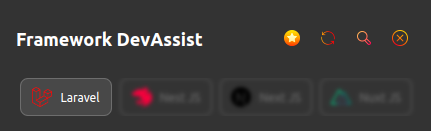

   

# Framework Dev Assist

Framework Dev Assist is a Chrome extension designed to assist developers working with frameworks. Currently, it focuses on providing valuable information and tools for Laravel developers, including command details, shortcuts, and explanations of collection methods. With a built-in search functionality, this extension makes it easier to find specific information quickly

## Features

- Laravel Commands: Access detailed information about Laravel commands, including shortcuts and their usage.
- Collection Methods: Quickly look up Laravel collection methods and understand their purposes.
- Search Functionality: Easily search for commands or methods within the extension.

## Installation

- Clone or download the repository.
- Open Chrome and navigate to chrome://extensions/.
- Enable "Developer mode" in the top-right corner.
- Click "Load unpacked" and select the extension folder.

## Usage

- Click on the extension icon in the Chrome toolbar to open the popup.
- Use the tabs to navigate between commands and collection methods.
- Use the search bar to quickly find specific information.

## Author
- [Shreyansh Panchal](https://github.com/theshreyanshpanchal)
A passionate developer focused on making tools to assist other developers in their daily work.

## Screenshots

   
